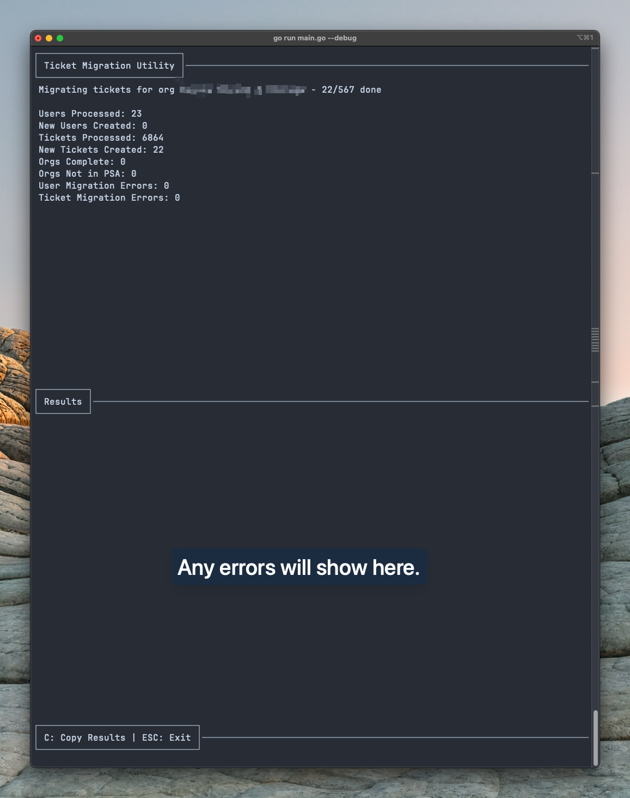

# Zendesk to ConnectWise Migration Utility
This utility is designed to migrate users and tickets from Zendesk to ConnectWise PSA (formerly Manage). It is run within the terminal and is customizable depending on what you need in your migration. Primarily, ticket sourcing is Zendesk tag-based, and from there you can set date ranges per tag for what tickets to migrate.

The terminal interface is a bit rough around the edges and is definitely more function over form! All visual elements are powered by Charm - mostly, their [Bubble Tea framework.](https://github.com/charmbracelet/bubbletea)

## What it Does
This utility will do the following:
- Automatically matches Zendesk agents to ConnectWise members if the email address matches, and uses that agent for ticket ownership and notes when a match is found in a ticket. This utility does not create new members in ConnectWise - you will need to do that manually.
- Gets all orgs in Zendesk that match the tags you have in the config, where tickets exist within the date range you have set.
  - If the org exists in ConnectWise, it will be selectable for migration. Due to time constraints when I built this, this utility does not create companies in ConnectWise - they must already exist with an exact name match, it is case-sensitive.
- Copies all users that meet the following criteria:
  - Not already in ConnectWise
  - A member of a Zendesk org that meets the tag criteria
  - User must have an email address in Zendesk - it will otherwise be skipped
- Copies all tickets that meet the following criteria:
  - Not already in ConnectWise
  - Ticket requester must have been copied to ConnectWise via the above step (or already exists within the company and has a matching email address)
  - Last updated within the date range you have set
- When orgs are matched and users are copied, the utility will assign it a custom field in Zendesk so it doesn't attempt to copy again on later runs
- Similarly with the above, a field will be set in the ConnectWise ticket identifying the Zendesk ticket ID and date closed so it can be referenced later if needed
  - Since you can't set the closed date in ConnectWise, this is a workaround to keep the original date closed in Zendesk
- Ticket notes will be created from the Zendesk ticket comments, with a line at the beginning stating when it was submitted in Zendesk, and the name of the sender if it is an external user that wasn't copied to ConnectWise. Note will be marked as Internal if it was internal in Zendesk.
- The utility will output any errors or warnings that may occur so that you can address them before running again.

If not noted above, the utility likely does not do it. Some that may come to mind are merges, Zendesk ticket fields, phone numbers in Zendesk users, etc.

## Disclaimer
This utility is provided as-is, and while it worked perfectly in my organization, all organizations are different so there may be issues that didn't come up for me. It is recommended to start small by tagging some orgs with a test tag in Zendesk so you don't immediately start with everything.

As this is an archive and was only needed for a one-time migration, this repo will not be maintained or updated.

## Prerequisites
- Go installed
- Create the following Service Ticket Custom Fields in ConnectWise, on the board you intend to migrate to. Note the ID numbers of the fields, as you will need them.
  - Zendesk Ticket ID
    - Field Type: Number
    - Number of Decimals: 0
    - Method of Entry: Entry Field
    - The rest: your preference, but it's recommended to make it Read Only
  - Zendesk Ticket Closed Date
    - Field Type: Date
    - The rest: your preference, but it's recommended to make it Read Only

## Getting Started
**WARNING: It is HIGHLY recommended to do this in a board that does not have an email connector in place, otherwise you are about to potentially send thousands of emails to your agents and clients!**

This guide assumes you have a baseline understanding of the Zendesk and ConnectWise PSA APIs. You will need to set up an API key for Zendesk, and create an API member/Client ID for ConnectWise. 
1. Clone this repo to your machine and either build it or run it directly with `go run main.go`
2. This will create a default config JSON. Go into the config file (~/ticket-migration/config.json) and enter the required info:
    - Zendesk API credentials (note that for your username you will want to enter your email WITHOUT the /token at the end)
    - ConnectWise API credentials
    - Zendesk default dates - the range you want it to look for tickets by default in YYYY-MM-DD format
    - Zendesk Tags - enter all the ones you want to migrate, including date ranges if you want it to be different than the default
    - The ConnectWise custom field IDs you created above
    - Everything else can be left blank
3. Run the utility again - it will verify your API connect and will prompt you to choose which board you want the tickets to go to, along with what status you want for tickets that aren't closed, and which one you want for closed tickets

Run through the utility prompts, and it will scan for organizations - select All or the organizations that you want to migrate and then hit enter to start the migration!

It is recommended to run the migration once with the default flags, and then again on the day of go-live for your ConnectWise PSA but with the `--migrateOpen` flag to so you can have your open tickets in ConnectWise. Don't use this flag until you're ready since it won't add new notes if it has already been migrated.

## CLI Flags
Some flags are available to run the utility with:
- `debug`, `d` - Enabled debug logging (logs are in ~/ticket-migration/migration.log)
- `ticketLimit`, `t` - Limit the total amount of tickets to create - good for testing/verification
- `migrateOpen`, `o` - Migrate open tickets. Default is false. It is recommended to 
- `migrateClosed`, `c` - Migrate closed tickets. Default is true. It is recommended to run this first, and then run again with the `--migrateOpen` flag to get your open tickets.
- `showNoAction` - Show output for users or tickets that have already been migrated, not recommended to keep on. Defaults to false.
- `showCreated` - Show output for users or tickets that have been created, not recommended to keep on. Defaults to false. (you will have a counter for total new users/tickets created even without using this)
- `showWarn` - Show output for users or tickets that have warnings you should check, such as if there is no email address. Defaults to true.
- `showError` - Show output for errors - defaults to true.
- `stopAfterOrgs` - Stop the migration after checking orgs - good if you need to just get a list of orgs you need to manually create in ConnectWise. Default is false.
- `stopAfterUsers` - Stop the migration after migrating users - if you only want to migrate users and not tickets. Default is false.

